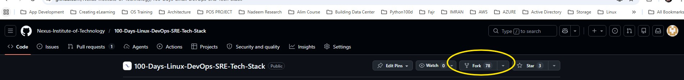
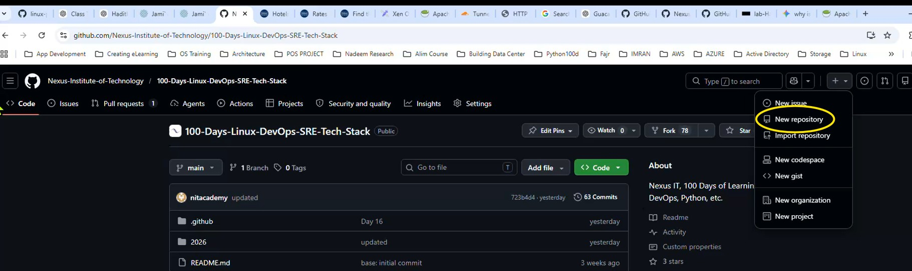
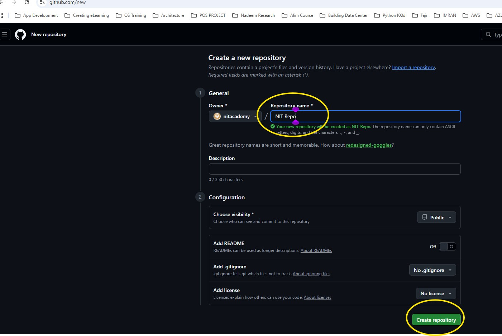
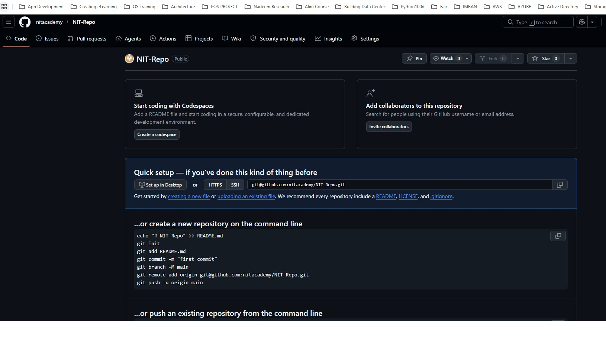

# Lab Practice 02 - GitHub par Remote Repository Create Karna

## Day 17
> May 25th, 2026

---

# Table of Contents

| Task | Title |
|------|--------|
| 1 | [GitHub par Sign In ya Sign Up Karna](#task-1---github-par-sign-in-ya-sign-up-karna) |
| 2 | [NIT Repository ko Copy (Fork) Karna](#task-2---nit-repository-ko-copy-fork-karna) |
| 3 | [Nayi Repository Create Karna](#task-3---nayi-repository-create-karna) |
| 4 | [Final Note](#final-note) |

---

# Task 1 - GitHub par Sign In ya Sign Up Karna

## Objective

GitHub account create karein ya agar pehle se account hai to sign in karein.

---

## Neeche Di Gayi Website Open Karein

```text
https://github.com
```

---

## Questions

1. GitHub kya hai?
2. Developers GitHub kyun use karte hain?
3. GitHub account create karne ka purpose kya hai?

---

# Task 2 - NIT Repository ko Copy (Fork) Karna

## Objective

NIT Repository ki apni copy (Fork) create karna.

---

## Neeche Di Gayi Repositories mein se Ek Select Karein

### English Repository

```text
https://github.com/Nexus-Institute-of-Technology/100-Days-Linux-DevOps-SRE-Tech-Stack
```

---

### Urdu Repository

```text
https://github.com/Nexus-Institute-of-Technology/100-Days-Linux-DevOps-SRE-Tech-Stack-Urdu
```

---

## Important Step

Upar di gayi repositories mein se kisi ek ko open karne ke baad:

Click karein:

```text
Fork
```

---



---

## Fork Ka Kya Matlab Hai?

Fork ka matlab hai:

- Repository ki apni copy create karna
- Project ko apne GitHub account mein copy karna
- Safe practice aur editing karna

---

# Task 3 - Nayi Repository Create Karna

## STEP 1

GitHub page ke upper right corner par click karein.



---

## STEP 2

Apni Repository ka naam rakhein:

```text
NIT Repo
```

---



---

## Next Step

Green button par click karein:

```text
Create repository
```

---

## STEP 3

Ab aapko neeche wali screen nazar aayegi:



---

# Final Questions

1. Remote Repository kya hoti hai?
2. GitHub mein Fork ka kya matlab hai?
3. Developers repositories kyun create karte hain?
4. Collaboration ke liye GitHub useful kyun hai?
5. Local Repo aur Remote Repo mein kya difference hai?

---

# Final Note

Aapka Task ab complete ho chuka hai.

Congratulations!!!

Ab aap ne:

- GitHub account create/sign in kar liya
- Repository fork kar li
- Remote Repository create kar li
- Apni GitHub learning journey start kar di

---