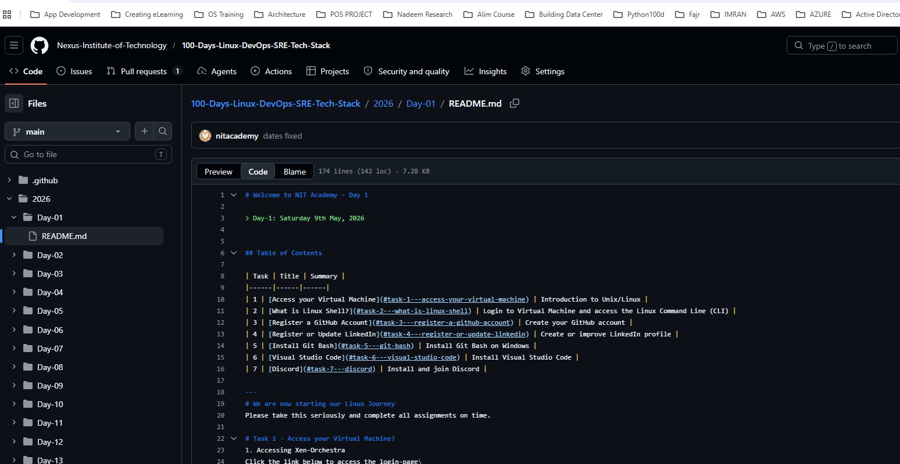

# Lab Practice 03 - Apna Pehla README Document Create Karna

## Day 17
> May 25th, 2026

---

# Table of Contents

| Task | Title |
|------|--------|
| 1 | [Apna Pehla README Document Create Karna](#task-1---apna-pehla-readme-document-create-karna) |
| 2 | [Existing Markdown Code Use Karna](#task-2---existing-markdown-code-use-karna) |
| 3 | [Documentation Improve Karne ke Liye ChatGPT Use Karna](#task-3---documentation-improve-karne-ke-liye-chatgpt-use-karna) |
| 4 | [Final Note](#final-note) |

---

# IMPORTANT NOTE

Har NIT Professional ke liye mandatory hai ke woh:

- README files create kare
- Documentation maintain kare
- Apna kaam Git repositories par push kare
- Professional documentation skills practice kare

Documentation har business aur IT organization ka bohat important hissa hoti hai.

---

# Task 1 - Apna Pehla README Document Create Karna

## Objective

Apna pehla professional README markdown file create karna seekhna.

---

## Step 1 - Apna Bootcamp2026 Folder Open Karein

Apni:

```text
Bootcamp2026
```

directory open karein.

---

## Step 2 - Ek Naya Folder Create Karein

Neeche diya gaya directory create karein:

```text
└── Day-18 (Practice Labs - Create your first README file)
```

---

## Step 3 - README File Create Karein

Upar wale folder ke andar ek file create karein jiska naam ho:

```text
README.md
```

---

## Question

IT mein documentation important kyun hai?

---

# Task 2 - Existing Markdown Code Use Karna

## Objective

Professional README markdown documents ka structure aur syntax samajhna.

---

## Neeche Diya Gaya Link Open Karein

```text
https://github.com/Nexus-Institute-of-Technology/100-Days-Linux-DevOps-SRE-Tech-Stack/blob/main/2026/Day-01/README.md?plain=1
```

---

## Step 1 - Markdown Code Copy Karein

Press karein:

```text
Ctrl + A
```

taake tamam content select ho jaye.

Phir content copy karein.

---



---

## Step 2 - README.md File mein Paste Karein

Apni:

```text
README.md
```

file mein wapas jayein aur copied content paste karein.

---

## Step 3 - Document Modify Karein

Document mein changes karein jaise:

- Apna text add karein
- Screenshots/images add karein
- Headings change karein
- New sections add karein
- Formatting modify karein

---

## Objective

Document ke andar use hone wali markdown syntax ko samjhein.

Examples:

- Headers
- Bullet Points
- Code Blocks
- Images
- Links
- Tables

---

# Task 3 - Documentation Improve Karne ke Liye ChatGPT Use Karna

## Objective

Markdown documentation ko improve aur organize karne ke liye ChatGPT use karna.

---

## Step 1

Apni:

```text
README.md
```

file se modified content copy karein.

---

## Step 2

Content ko ChatGPT mein paste karein.

---

## Step 3

ChatGPT se poochein:

```text
Please create a professional single markdown format document for me.
```

---

## Step 4

Jab ChatGPT markdown document generate kar de:

- Generated markdown copy karein
- Usay dobara apni README.md file mein paste karein

---

# Final Questions

1. README file kya hoti hai?
2. Documentation important kyun hai?
3. Markdown kya hota hai?
4. Developers GitHub documentation kyun use karte hain?
5. Aapne kaunsi markdown syntax examples seekhi hain?
6. Documentation ke liye ChatGPT useful kyun hai?

---

# Final Activity

## Apni README File Customize Karein

Apni README mein neeche di gayi cheezein add karein:

- Apna Naam
- Apni Linux Learning Journey
- Screenshots
- Learned Commands
- GitHub Repository Links
- Images
- Notes

---

# Final Note

Aapka task ab complete ho chuka hai!

Congratulations!

Ab aap ne yeh sab seekh liya hai:

- README files create karna
- Markdown syntax use karna
- Professional documentation modify karna
- Documentation improve karne ke liye ChatGPT use karna
- Professional GitHub-ready documents create karna

---